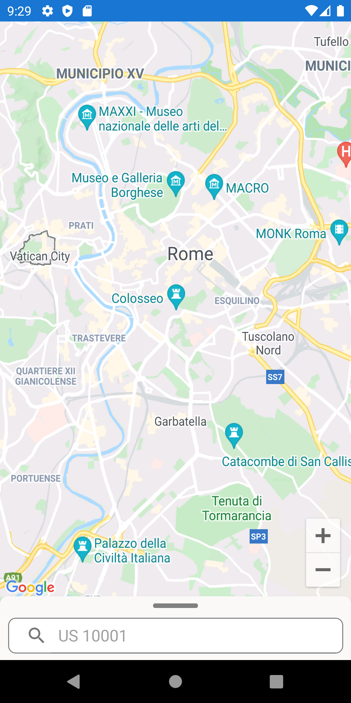
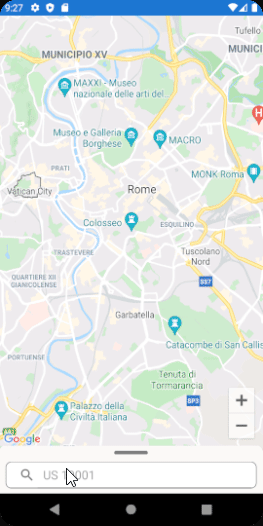

# City Finder App

  
   

Search by zip codes made easy.

## Installation

Download the [latest release](https://github.com/srjheam/CityFinderApp/releases) from GitHub.

## Made using

- Google Maps API
- [Newtonsoft.Json](https://www.newtonsoft.com/json)
- [Xamarin.Forms](https://docs.microsoft.com/pt-br/xamarin/xamarin-forms)
- [Zippopotam.us](https://api.zippopotam.us/)

## Known Limitations

- If the API response json has any null fields, an exception will be thrown and the zip code will be considered invalid.

## License

Licensed under the [MIT License](./LICENSE).